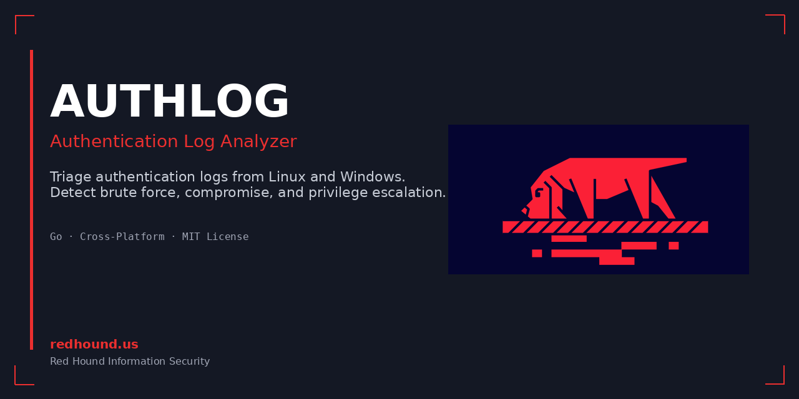

<p align="center">
  
</p>

# authlog

**Authentication log analyzer and triage tool**

`authlog` parses authentication logs from Linux (`auth.log`, `secure`) and Windows (Security Event XML/JSON export) and produces a structured summary of authentication events: failed logins, successful logins, privilege escalations, brute force patterns, and anomalous activity. One command to triage auth activity.

---

## Authorized Use

This tool is intended for defensive security, incident response, and authorized administrative auditing.
Only analyze systems and logs that you own or have explicit permission to assess.

---

## Who it is for

- **Incident responders** triaging compromised systems
- **Security analysts** reviewing authentication patterns
- **System administrators** auditing access
- **Compliance teams** verifying access controls

---

## Features

- Parses **Linux** `auth.log` / `secure` — sshd, sudo, su events via regex
- Parses **Windows Security Event XML** — exported from Event Viewer (`wevtutil`)
- Parses **Windows Security Event JSON** — exported via PowerShell `Get-WinEvent`
- **Auto-detects** log format based on content inspection
- **Brute force detection** — N+ failures from same source in configurable time window
- **Compromise indicator** — successful login after brute force from same IP
- **Privilege escalation** tracking — sudo, su, Windows Event IDs 4672, 4648
- **Timeline** and peak activity hour
- **Ranked lists** — top failed sources, top targeted accounts
- **Output formats**: colored text (default), JSON, CSV
- **Time filtering** with `--since` and `--until`
- **Exit codes**: `0` = clean, `1` = suspicious, `2` = error

---

## Installation

### From source

```bash
git clone https://github.com/redhoundinfosec/authlog
cd authlog
make build
# Binary: ./bin/authlog
```

### Go install

```bash
go install github.com/redhoundinfosec/authlog/cmd/authlog@latest
```

---

## Quick Start

```bash
# Analyze a single Linux auth log
authlog analyze /var/log/auth.log

# Analyze Windows Security events exported as XML
authlog analyze windows-security.xml

# Analyze multiple files — merged timeline
authlog analyze auth.log backup-auth.log

# JSON output to a file
authlog analyze auth.log --format json -o report.json

# Filter by time window
authlog analyze auth.log --since 2026-04-01 --until 2026-04-02

# Show top 20 entries, lower brute force threshold
authlog analyze auth.log --top 20 --threshold 3

# CSV for SIEM import
authlog analyze auth.log --format csv -o events.csv

# Verbose — show every individual event
authlog analyze auth.log --verbose

# Quiet mode — one-line summary
authlog analyze auth.log --quiet
```

---

## CLI Reference

```
Usage: authlog <command> [flags]

Commands:
  analyze    Parse and summarize authentication events
  version    Print version information

Flags for analyze:
  -f, --format string     Output format: text, json, csv (default: text)
  -o, --output string     Write output to file
      --since string      Start time filter (RFC3339 or YYYY-MM-DD)
      --until string      End time filter (RFC3339 or YYYY-MM-DD)
      --top int           Number of top entries to show (default: 10)
      --threshold int     Brute force threshold N failures/5 min (default: 5)
      --no-color          Disable colored output
  -q, --quiet             Summary line only
  -v, --verbose           Show individual events
```

---

## Sample Output

```
authlog v0.1.0 — Authentication Log Analysis

  Source: linux-auth.log
  Format: linux
  Period: 2026-04-03 14:20:01 → 2026-04-03 15:45:00
  Total Events: 38

  EVENT SUMMARY
  ├─ Successful logins             8
  ├─ Failed logins                 21
  ├─ Privilege escalation          5
  └─ Other                         4

  ⚠ BRUTE FORCE DETECTED
  ● 10.0.0.50 → 8 failures in 1m17s targeting: root, admin, user
    └─ FOLLOWED BY successful login as admin at 14:25:03  [CRITICAL]

  TOP FAILED LOGIN SOURCES
   1. 10.0.0.50            8 failures
   2. 203.0.113.15         5 failures
   3. 45.33.32.156         3 failures
   4. 185.220.101.1        3 failures
   5. 198.51.100.22        2 failures

  TOP TARGETED ACCOUNTS
   1. root                 14 failures
   2. admin                 7 failures
   3. user                  2 failures

  PRIVILEGE ESCALATION
  ├─ admin: sudo: /usr/bin/apt update (14:30:15)
  ├─ admin: sudo: /bin/systemctl restart nginx (14:32:10)
  ├─ admin: sudo: /usr/bin/cat /etc/shadow (14:35:22)  [WARNING]
  ├─ admin: sudo: /usr/bin/id (14:40:00)
  └─ devops: sudo: /usr/bin/python3 /opt/app/deploy.py (14:41:00)

  TIMELINE
  2026-04-03 14:00  ██████████████████████████ 28
  2026-04-03 15:00  ██ 2

  Verdict: SUSPICIOUS — brute force with subsequent successful login detected; sensitive privilege escalation command: /usr/bin/cat /etc/shadow
```

---

## Windows Event Collection

**Export via Event Viewer (XML):**
```powershell
wevtutil qe Security /f:xml > windows-security.xml
# With count limit:
wevtutil qe Security /c:1000 /rd:true /f:xml > recent-security.xml
```

**Export via PowerShell (JSON):**
```powershell
Get-WinEvent -LogName Security -MaxEvents 500 | ConvertTo-Json -Depth 5 > security.json
# Filtered by time:
Get-WinEvent -FilterHashtable @{LogName='Security'; StartTime='2026-04-01'; EndTime='2026-04-03'} |
  ConvertTo-Json -Depth 5 > security-filtered.json
```

---

## Supported Event IDs

| Event ID | Description |
|----------|-------------|
| 4624 | Successful logon |
| 4625 | Failed logon |
| 4634 | Logoff |
| 4648 | Explicit credential logon |
| 4672 | Special privileges assigned (admin logon) |
| 4720 | User account created |
| 4732 | Member added to security group |

---

## Exit Codes

| Code | Meaning |
|------|---------|
| 0 | Analysis complete, no suspicious patterns |
| 1 | Suspicious patterns detected |
| 2 | Error (bad arguments, unreadable file, parse failure) |

Use exit codes in scripts:
```bash
authlog analyze auth.log --quiet
if [ $? -eq 1 ]; then
    echo "ALERT: suspicious auth activity detected"
    # page on-call, create ticket, etc.
fi
```

---

## Building

```bash
make build       # Build to ./bin/authlog
make test        # Run all tests
make test-v      # Run tests with verbose output
make lint        # golangci-lint
make release     # Cross-compile for Linux, macOS, Windows
make clean       # Remove build artifacts
```

---

## License

MIT — Copyright 2026 Red Hound Information Security LLC. See [LICENSE](LICENSE).
---

> **Built by [Red Hound InfoSec](https://redhound.us)** — Penetration testing, attack surface analysis, and security consulting.
>
> [Visit redhound.us](https://redhound.us) | [Read the blog](https://redhound.us/blog.html) | [Book a consultation](https://redhound.us/#contact)
